# Lab 01: Configure GHAzDO in Azure DevOps

## Lab Scenario

In this lab, we configure GitHub Advanced Security (GHAS) within Azure DevOps, enabling enhanced security measures and permissions for the eShopOnWeb project. We set up billing, activate Advanced Security, and establish permissions for managing security alerts.

## Lab Objectives

In this lab, you will perform:
- Task 1: Sign up and configure the eShopOnWeb team project in Azure DevOps
- Task 2: Enable Advanced Security from portal
- Task 3: Setup Advanced Security permissions

## Estimated Timing: 45 minutes

## Architecture Diagram

  

### Task 1: Sign up and configure the eShopOnWeb team project in Azure DevOps

1. Open the **Edge browser**, and navigate to **Azure DevOps** using the link below. Select **Start Free**, and sign in with the credentials provided in the Environment variables.

   ```
    https://dev.azure.com
   ```
      

1. On the **Get Started with Azure DevOps** page, click on **Continue**.

      

1. On the **Almost done** page, enter the **captcha** and click on **Continue**.

      

1. On the **Azure DevOps** page, at the button left, click on **Organization settings**. then select **Billing** (opening this screen takes a few seconds).

    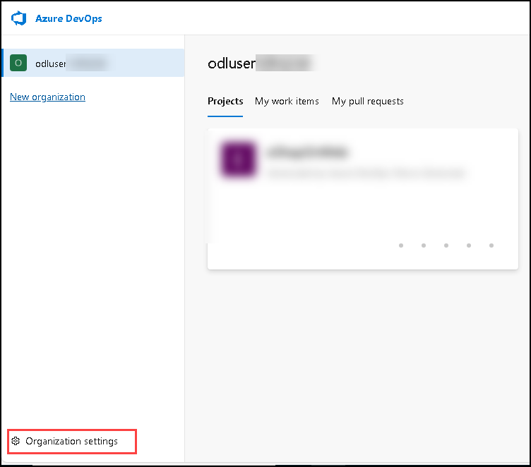

1. From the left navigation pane, select **Billing** and click **Set up billing**. On the right-hand side of the screen, select the **Existing subscription** listed and click **Save** to link the subscription with the organization.

   

   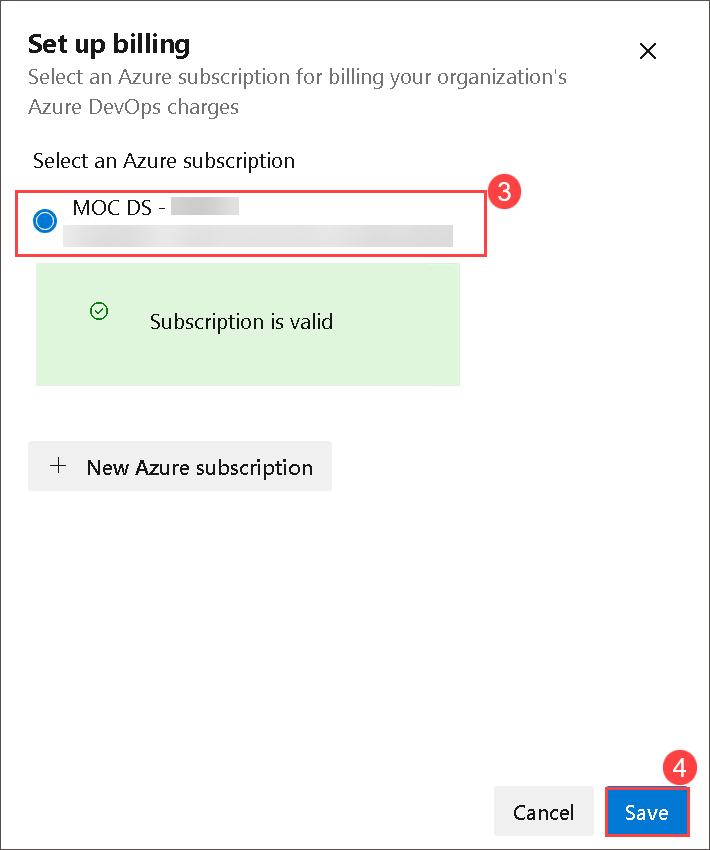

1. Once the screen shows the linked Azure Subscription ID at the top, change the number of **Paid parallel jobs** for **MS Hosted CI/CD** from 0 to **1**. Then click the **SAVE** button at the bottom.

   

1. On the **Organization Settings** page, navigate to the **Security** section and click **Policies**. Turn on the **Toggle** for **Third-party application access via OAuth**.

     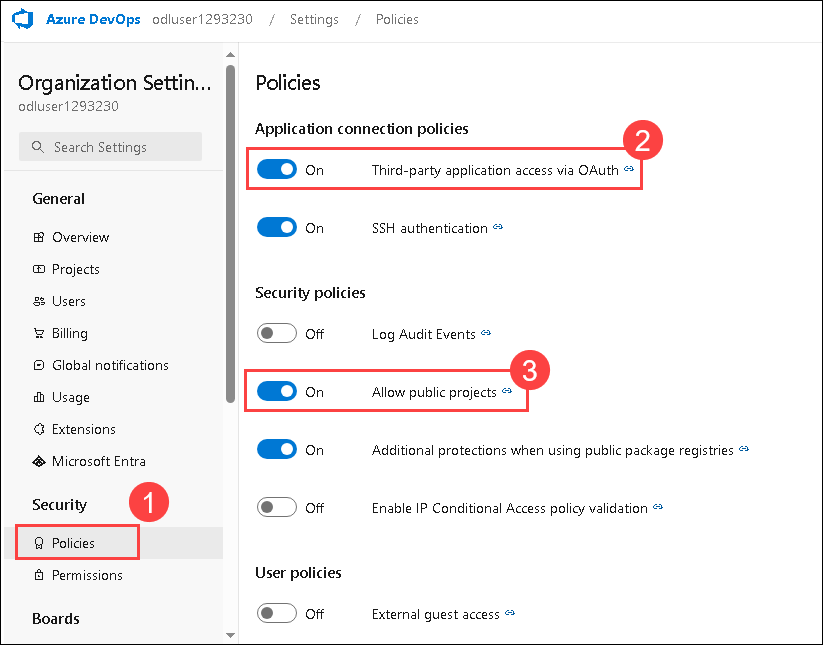
   
      > **Note:** The OAuth setting helps enable tools such as the DemoDevOpsGenerator to register extensions. Without this, several labs may fail due to a lack of the required extensions.

1. Toggle the switch to **On** for **Allow public projects** and click on **Save** when the **change policy setting** is prompted.

     > **Note:** Extensions used in some labs might require a public project to allow using the free version.

1. Navigate to **azuredevopsdemogenerator** using the link below. This utility site will automate the process of creating a new Azure DevOps project within your account that is prepopulated with content (work items, repos, etc.) required for the lab. For more information on the site, please see [https://docs.microsoft.com/en-us/azure/devops/demo-gen](https://docs.microsoft.com/en-us/azure/devops/demo-gen).

   ```
   https://azuredevopsdemogenerator.azurewebsites.net/
   ```
  
1. Click on **Sign in** and log in using the Microsoft account associated with your Azure DevOps subscription.

    

1. Please click on **Accept** to grant permission to access your subscription.

1. Click **Choose Template**.

    

1. Select the **eShopOnWeb** template and click on **Select Template**.

    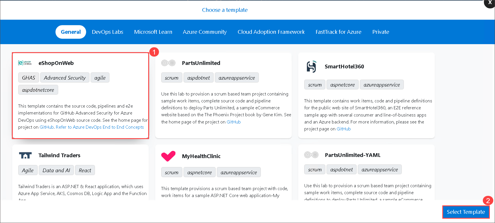

1. Provide a project name, **eShopOnWeb**, and choose your **Organization**, then click on **Create Project** and wait for the process to complete.

   

1. Once the process is complete, click on **Navigate to the project**.

   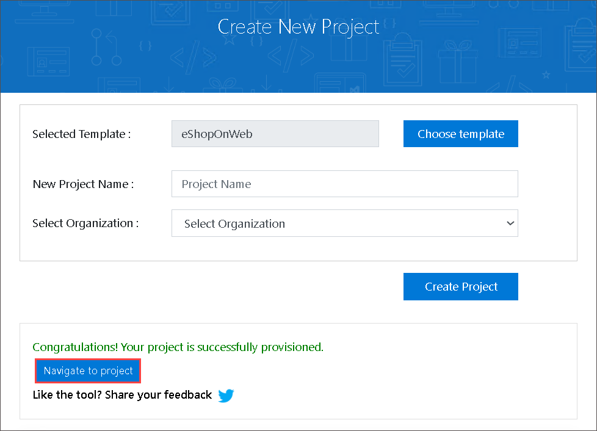

## Create Work item

You can follow these steps to create a work item to link while committing the changes.

1. Navigate to the **eShopOnWeb** project and select **Boards** from the left menu and select **Work items**

      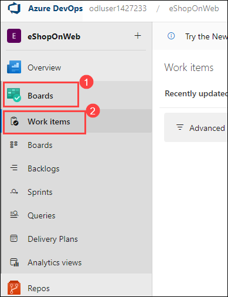

1. On the **Work items** page, select **+New Work Item** and select **Issue** from the drop-down menu.

      

1. Enter **Advanced security related events** in the Title box

1. Enter **Work item to link for all the commits related to Advanced security events** in the description box and click on **Save**

      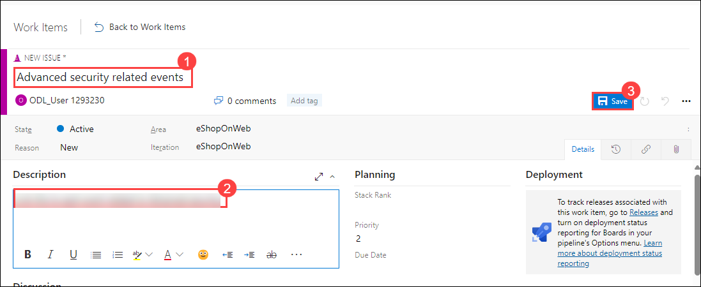

## Create AzDevOps PAT 

1. Click on **User settings** and select **Personal access tokens**

   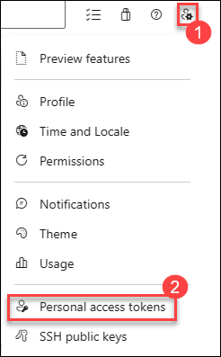

1. Select **+New Token**

1. On **Create a new personal access token** window, enter the below values and click on **Create**

  | Setting | Value |
  |----------|-------|
  | Name | AzDo_PAT |
  | Scopes | Full access |

  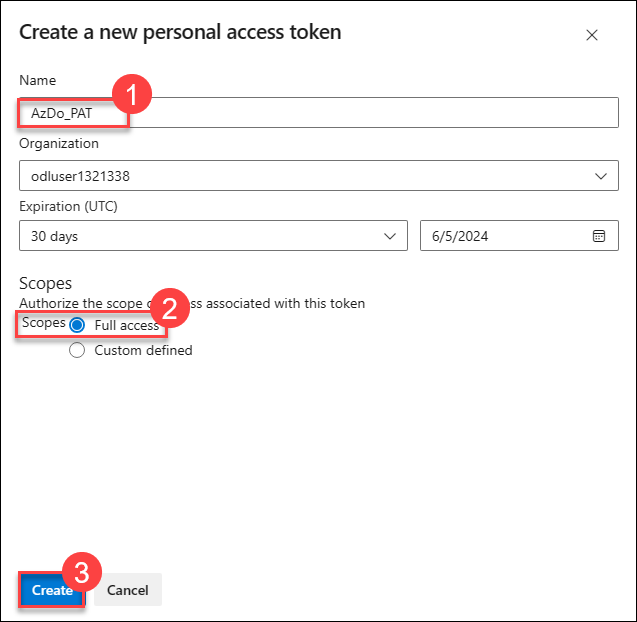

1. Copy the PAT Token and paste it in the notepad.

1. Navigate to **eShopOnWeb** project > **Repos** > **src** > **Web** > and select **Constants.cs** file and click on **Edit**

  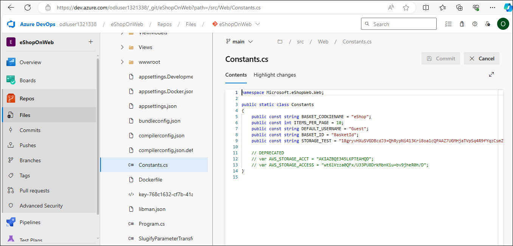

1. Add public const string AZ_PAT = "Your-Secret-Value"; to the existing code as shown below. Copy the secret value pasted in the notepad and replace with "Your-Secret-Value" and commit the changes.

  

1. On the **Commit** page, provide the branch name as **addsecret** and link the workitem created earlier and click on **Commit**

  

### Task 2: Enable Advanced Security from Portal

GitHub Advanced Security for Azure DevOps includes extra permissions for more levels of control around Advanced Security results and management. Be sure to adjust individual permissions for your repository.

To ensure Azure DevOps Advanced Security is enabled in your organization, you can follow these steps:

1. Open the **eShopOnWeb** project and click on **Project Settings** available in the lower left corner. In the left menu area under Repos, click **Repositories**.

1. Click on the **eShopOnWeb** repository.

1. Click on **Settings**, then click on **Advanced Security**, to turn it on.

    

1. Click **Begin Billing**.

    

1. Advanced Security and Push Protection are now enabled. You can also onboard Advanced Security at [Project-level](https://learn.microsoft.com/en-us/azure/devops/repos/security/configure-github-advanced-security-features?view=azure-devops&tabs=yaml#project-level-onboarding) and [Organization-level](https://learn.microsoft.com/en-us/azure/devops/repos/security/configure-github-advanced-security-features?view=azure-devops&tabs=yaml#organization-level-onboarding) as well.

### Task 3: Update the pipeline and create pull request

1. Navigate to the **Pipelines** in the left menu and select the existing pipeline.

  

1. Click on **Edit**

  

1. Change the branch to **addsecret**

   

1. Delete the code in the pipeline which includes the test and production deployments to azure. (from line 70)

1. The final code should look like the below

  ```
    trigger:
    - main
    
    pool:
      vmImage: ubuntu latest
    
    extends: 
      template: template.yaml
      parameters:
        stages:
          - stage: Build
            displayName: 'Build'
            jobs:
            - job: Build
              steps:
              - checkout: self
    
              - task: DotNetCoreCLI@2
                displayName: Restore 
                inputs:
                  command: restore
                  projects: '**/*.csproj'
    
              - task: ms.advancedsecurity-tasks.codeql.init.AdvancedSecurity-Codeql-Init@1
                condition: and(succeeded(), ne(variables['Build.Reason'], 'PullRequest'))
                displayName: 'Initialize CodeQL'
                inputs:
                  languages: csharp
                  querysuite: default
    
              - task: DotNetCoreCLI@2
                displayName: Build
                inputs:
                  projects: '**/*.csproj'
                  arguments: '--configuration $(BuildConfiguration)'
    
              - task: ms.advancedsecurity-tasks.dependency-scanning.AdvancedSecurity-Dependency-Scanning@1
                condition: and(succeeded(), ne(variables['Build.Reason'], 'PullRequest'))
                displayName: 'Dependency Scanning'
    
              - task: ms.advancedsecurity-tasks.codeql.analyze.AdvancedSecurity-Codeql-Analyze@1
                condition: and(succeeded(), ne(variables['Build.Reason'], 'PullRequest'))
                displayName: 'Perform CodeQL analysis'
    
              - task: ms.advancedsecurity-tasks.codeql.enhance.AdvancedSecurity-Publish@1
                condition: and(succeeded(), ne(variables['Build.Reason'], 'PullRequest'))
                displayName: 'Publish Results'
    
              - task: DotNetCoreCLI@2
                displayName: Test
                inputs:
                  command: test
                  projects: '[Tt]ests/**/*.csproj'
                  arguments: '--configuration $(BuildConfiguration) --collect:"Code coverage"'
    
              - task: DotNetCoreCLI@2
                displayName: Publish
                inputs:
                  command: publish
                  publishWebProjects: True
                  arguments: '--configuration $(BuildConfiguration) --output $(build.artifactstagingdirectory)'
                  zipAfterPublish: True
    
              - task: PublishBuildArtifacts@1
                displayName: 'Publish Artifact'
                inputs:
                  PathtoPublish: '$(build.artifactstagingdirectory)'
                condition: succeededOrFailed()
   ```
     
1. Click on **Validate and save**

   

1. Click on **Save**

   

1. Navigate to **Repos** > **Pull requests** and click on **Create a Pull request**

   

1. Once the build got succeeded, click on **Approve** and click on **complete**

 
### Task 3: Setup Advanced Security permissions

In this task, you will configure advanced security permissions for the eShopOnWeb repository in Azure DevOps. This involves granting specific permissions to project administrators to manage security alerts and settings related to the repository.

1. In the lower-left corner, click on **Project Settings**. In the left menu area under the **Repos** section, click **Repositories**.

      
  	
1. Click on the **eShopOnWeb** repository.

1. Select **Security** and click on **Project Administrators**.

1. Next to Advanced Security: manage and dismiss alerts, click the **dropdown**, and select  **Allow**.

1. Next to Advanced Security: manage settings, click the **dropdown**, and select **Allow**.

1. Next to Advanced Security: view alerts, click the dropdown, and select **Allow**.

      

1. Make sure a green checkmark ✅ appears next to the selected permission.

## Install extension

You can follow these steps to install an extension which is needed in upcoming tasks.

1. Select the **Marketplace** icon from the top right corner and select **Browse marketplace** from the list

      

1. On the **Marketplace** window, under **Azure DevOps** search and select **replace tokens**

      

1. Select **Get it free**

      

1. Select **Install**

      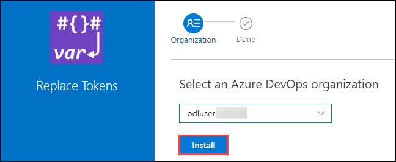

1. Select **Proceed to Organization** to navigate back to **Azure DevOps**

      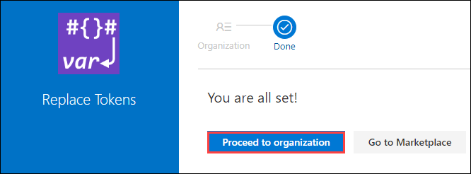

Please feel free to go through the documentation for further understanding: [GitHub Advanced Security for Azure DevOps](https://azure.microsoft.com/en-us/products/devops/github-advanced-security) and [Configure GitHub Advanced Security for Azure DevOps](https://learn.microsoft.com/en-us/azure/devops/repos/security/configure-github-advanced-security-features?view=azure-devops&tabs=yaml)

## Review
In this lab, you have completed the following:

- Configured the eShopOnWeb team project.
- Enabled Advanced Security from the Portal.
- Set up Advanced Security permissions.

Click on **Next** to proceed with the next lab.
