## Lab 01: Configure GHASDO in Azure DevOps

 
### Task 1: Configuring the eShopOnWeb team project

1. Navigate to [https://azuredevopsdemogenerator.azurewebsites.net](https://azuredevopsdemogenerator.azurewebsites.net/). This utility site will automate the process of creating a new Azure DevOps project within your account that is prepopulated with content (work items, repos, etc.) required for the lab. For more information on the site, please see [https://docs.microsoft.com/en-us/azure/devops/demo-gen](https://docs.microsoft.com/en-us/azure/devops/demo-gen).

1. Sign in using the Microsoft account associated with your Azure DevOps subscription.

    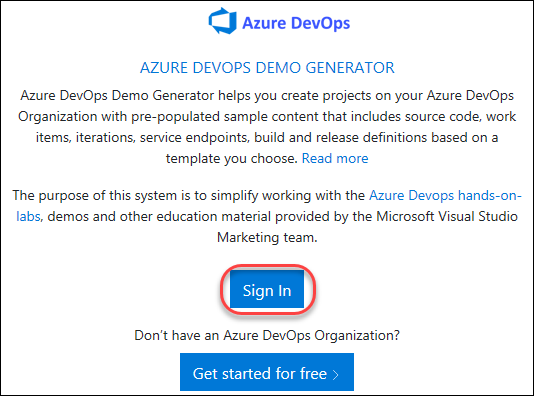

1. **Accept** the permission requests for accessing your subscription.

1. Select your Azure DevOps organization and enter the project name **"eShopOnWeb"**. Click **Choose Template**.

    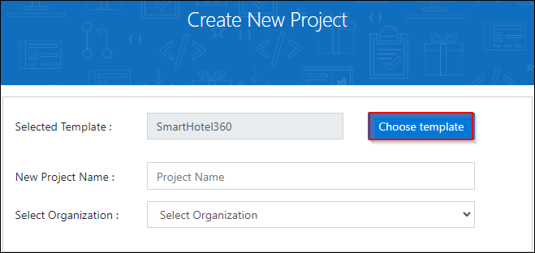

1. Select the **eShopOnWeb** template and click **Select Template**.

    #Need to update image
    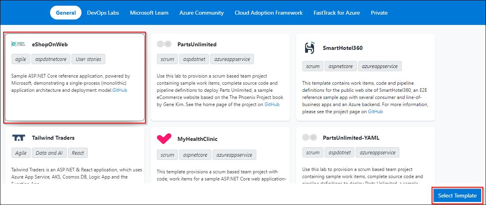
1. Provide a project name and choose your Organization.

1. Click **Create Project** and wait for the process to complete.

    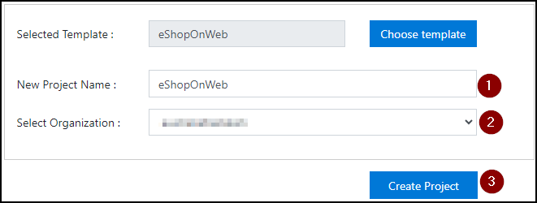

1. Navigate to your eShopOnWeb project on Azure DevOps. It will be something like [https://dev.azure.com/YOURACCOUNT/eShopOnWeb]()

### Task 2: Configure the approvals and checks in environments

Once you provision the project follow the below steps to configure the approvals and checks

1. Navigate to **Pipelines** section and select **Environments**

    

1. Select **Production** environment

    

1. Navigate to **Approvals and checks** and select **Approvals**
    
    

1. Choose an approver and click on create

    

1. To select additional checks, click on + button

    

1. Select **Required tempalte** and click on Next

    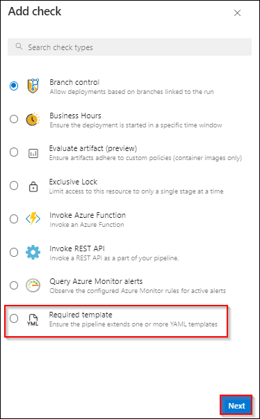

1. Click on + button to add tempalte

    

1. Input the values in the Required YAML template fields and click on **Add required template** button

    - Choose **Azure Repos** radio button
    - Repository: **eShoponweb**
    - Ref: **refs/heads/main**
    - Path to required YAML template: **template.yaml**

   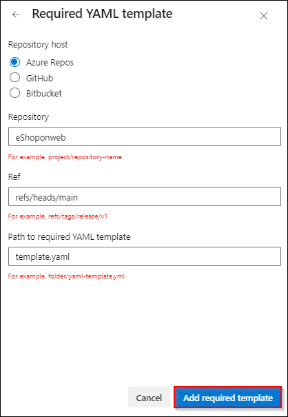

1. Repository will be pointing to the main branch, click on **Create** button.

    

1. Choose the Kebab menu &#8942; and select **Security** option to configure the environment security.

    

1. On the **Pipeline permission** section choose **+** button and select the pipeline.
Repeat the same for **Test** environment.

    

### Task 3: Create Azure Resource Manager service connection
> To create Azure Resource Manager service connection, you must be the owner or co-owner of the Azure Subscription

1. Sign in to your organization your organization and select your project

1. Navigate to **Project Settings** and select **Service connections**

1. Select **+ New service connection**, select the type of service as **Azure Resource Manger**, and then select **Next**

1. Choose an authentication method, and then select **Next**

    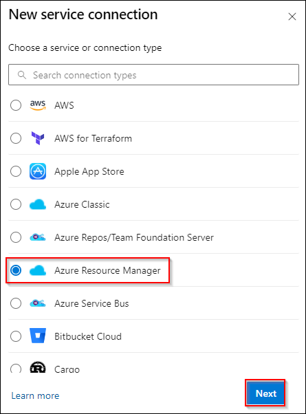

1. Choose the Authentication type as **Service principal (automatic)** and then select **Next**

    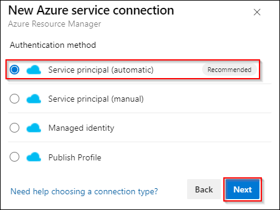

1. Choose a Subscription and Provide the service connection name as **eShopOnWeb** and select **Save**

    

> Service connection with the same name is already present in the YAML pipeline, no need to modify the pipeline.

### Task 4: Grant Permission to Pipeline

1. Open **eShopOnWeb** service connection created in the previous task

    

1. Choose Security option on the Kebab menu &#8942;
    
    

1.  Under the **Pipelines permission** section, choose **+** button and select the pipeline **eShopOnWeb**. This grants the permission to the YAML pipeline to use the service connection.

    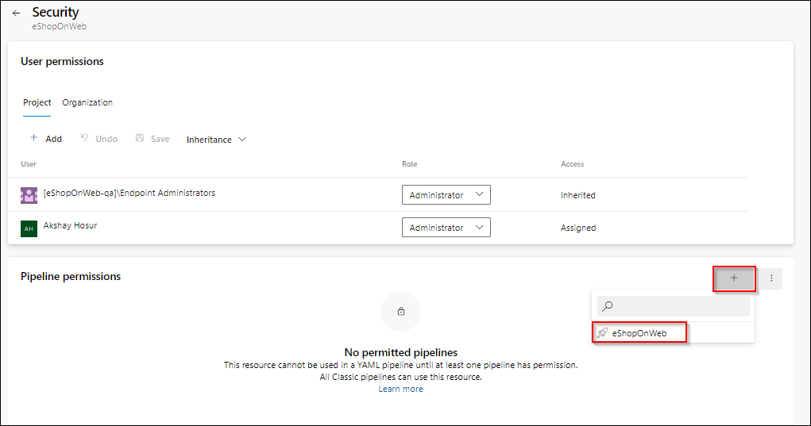

1. Edit the YAML pipeline and make sure that the subscription has been configured correctly.

1. Trigger the pipeline to see the Build and Deployment in action.

> As part of the deployment, Azure Resource Manager template will provision the resource group and the resources in your Azure Subscription.

### Task 1: Enable Advanced Security from Portal

GitHub Advanced Security for Azure DevOps includes extra permissions for more levels of control around Advanced Security results and management. Be sure to adjust individual permissions for your repository.

To ensure Azure DevOps Advanced Security is enabled in your organization, you can follow these steps:

1. Open Edge browser and navigate to https://dev.azure.com and select **Start Free** and sign in with the credentials provided in the Environment variables.

      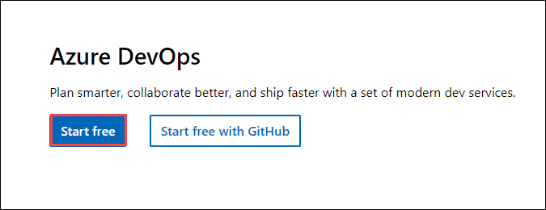

1. On **Get Started with Azure DevOps** page, click on **Continue**

      

1. If prompted (*"Almost done"*), leave the name for the Azure DevOps organization at default (it needs to be a globally unique name) and pick a hosting location close to you from the list, enter the required **captcha** and click on **Continue**

      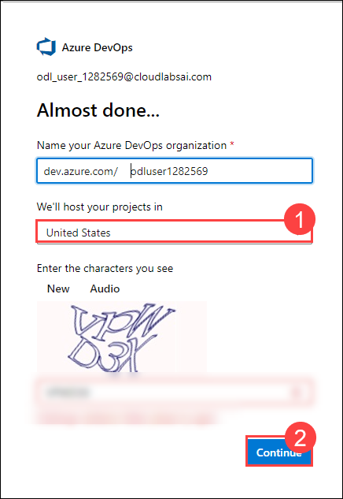

1. On **Create new Project** window, provide the below settings:

     - name: **eShopOnWeb** 
     - visibility: **Private**

1. Click on **Create**.

      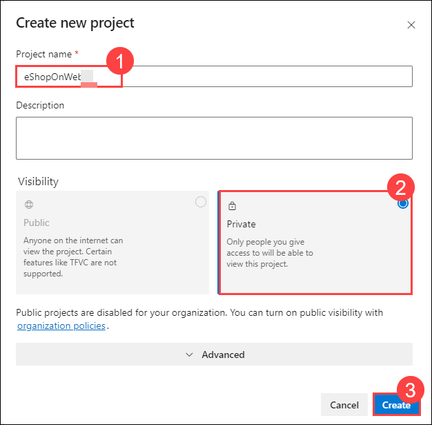

1. At the **Organization settings** screen click **Billing** (opening this screen takes a few seconds).

1. Click **Setup billing** and on the right-hand side of the screen select the **Existing subscription** listed and click **Save** to link the subscription with the organization.
 
1. Navigate to **eShopOnWeb**, devOps project and click on **Repos>Files** , **Import a Repository**. Select **Import**. On the **Import a Git Repository** window, paste the following URL https://github.com/MicrosoftLearning/eShopOnWeb.git  and click **Import**:

      

1.	In the lower-left corner, click on **Project Settings**. In the left menu area under Repos, click **Repositories**.

1.	Click on the **eShopOnWeb** repository.

1.	Click on Settings, then click **Advanced Security**, On to turn it on.

      

1.	Click Begin **Billing**.

      

1.	Advanced Security and Push Protection are now enabled. You can also onboard Advanced Security at [Project-level](https://learn.microsoft.com/en-us/azure/devops/repos/security/configure-github-advanced-security-features?view=azure-devops&tabs=yaml#project-level-onboarding) and [Organization-level](https://learn.microsoft.com/en-us/azure/devops/repos/security/configure-github-advanced-security-features?view=azure-devops&tabs=yaml#organization-level-onboarding) as well
 

   

### Task 2: Setup Advanced Security permissions

In this task, you will configure Advanced Security permissions for the eShopOnWeb repository in Azure DevOps. This involves granting specific permissions to Project Administrators to manage security alerts and settings related to the repository.

1.	In the lower-left corner, click on **Project Settings**. In the left menu area under Repos, click **Repositories**.

1.	Click on the **eShopOnWeb** repository.

1.	Select **Security** and click on **Project Administrators**.

2.	Next to Advanced Security: manage and dismiss alerts, click the dropdown and select  **Allow**.

3.	Next to Advanced Security: manage settings, click the dropdown and select **Allow**.

4.	Next to Advanced Security: view alerts, click the dropdown and select **Allow**.

      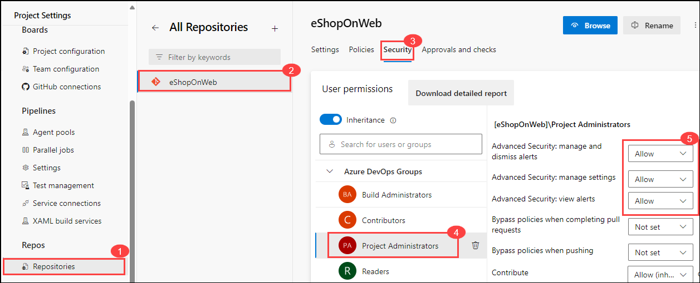

5.	If successful, a green checkmark ✅ appears next to the selected permission.
  

