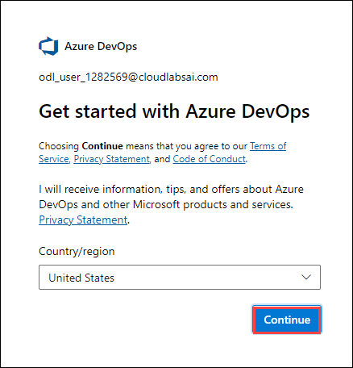
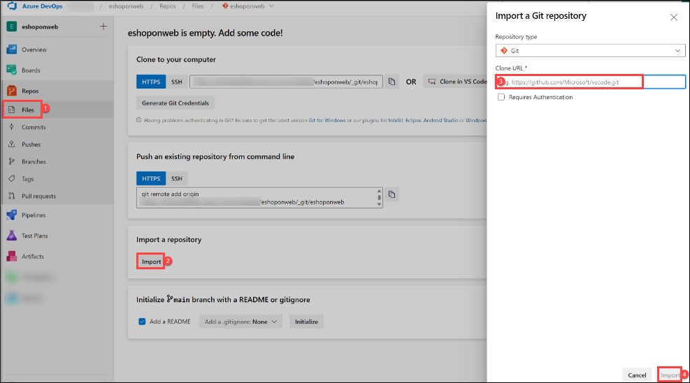

## Lab 01: Configure GHASDO in Azure DevOps

### Task 1: Enable Advanced Security from Portal

GitHub Advanced Security for Azure DevOps includes extra permissions for more levels of control around Advanced Security results and management. Be sure to adjust individual permissions for your repository.

To ensure Azure DevOps Advanced Security is enabled in your organization, you can follow these steps:

1. Open Edge browser and navigate to https://dev.azure.com and select **Start Free** and sign in with the credentials provided in the Environment variables.

      

1. On **Get Started with Azure DevOps** page, click on **Continue**

      

1. If prompted (*"Almost done"*), leave the name for the Azure DevOps organization at default (it needs to be a globally unique name) and pick a hosting location close to you from the list, enter the required **captcha** and click on **Continue**

      

1. On **Create new Project** window, provide the below settings:

     - name: **eShopOnWeb** 
     - visibility: **Private**

1. Click on **Create**.

      

1. At the **Organization settings** screen click **Billing** (opening this screen takes a few seconds).

1. Click **Setup billing** and on the right-hand side of the screen select the **Existing subscription** listed and click **Save** to link the subscription with the organization.
 
1. Navigate to **eShopOnWeb**, devOps project and click on **Repos>Files** , **Import a Repository**. Select **Import**. On the **Import a Git Repository** window, paste the following URL https://github.com/MicrosoftLearning/eShopOnWeb.git  and click **Import**:

      

1.	In the lower-left corner, click on **Project Settings**. In the left menu area under Repos, click **Repositories**.

1.	Click on the **eShopOnWeb** repository.

1.	Click on Settings, then click **Advanced Security**, On to turn it on.

      

1.	Click Begin **Billing**.

      

1.	Advanced Security and Push Protection are now enabled. You can also onboard Advanced Security at [Project-level](https://learn.microsoft.com/en-us/azure/devops/repos/security/configure-github-advanced-security-features?view=azure-devops&tabs=yaml#project-level-onboarding) and [Organization-level](https://learn.microsoft.com/en-us/azure/devops/repos/security/configure-github-advanced-security-features?view=azure-devops&tabs=yaml#organization-level-onboarding) as well
 

   

### Task 2: Setup Advanced Security permissions

In this task, you will configure Advanced Security permissions for the eShopOnWeb repository in Azure DevOps. This involves granting specific permissions to Project Administrators to manage security alerts and settings related to the repository.

1.	In the lower-left corner, click on **Project Settings**. In the left menu area under Repos, click **Repositories**.

1.	Click on the **eShopOnWeb** repository.

1.	Select **Security** and click on **Project Administrators**.

2.	Next to Advanced Security: manage and dismiss alerts, click the dropdown and select  **Allow**.

3.	Next to Advanced Security: manage settings, click the dropdown and select **Allow**.

4.	Next to Advanced Security: view alerts, click the dropdown and select **Allow**.

      

5.	If successful, a green checkmark ✅ appears next to the selected permission.
  

