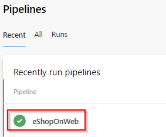
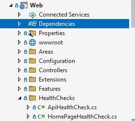
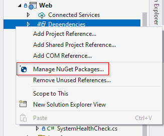
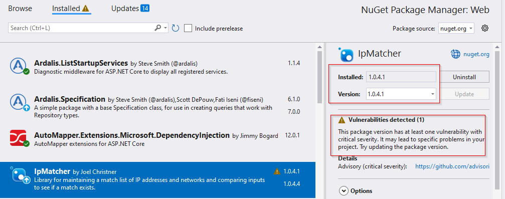
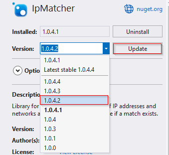

## Lab 03: Dependency Scanning

### Task 3: Setup Dependency Scanning
Dependency Scanning scans your project's dependencies such as libraries, frameworks, and packages, to identify any known security vulnerabilities or outdated versions that may pose a risk to your application

1.	Select and Edit the pipeline you want to add scanning to **eShopOnweb**

    

1.	Locate the section where the build steps are defined, hint: look for *- task: DotNetCoreCLI@2*.

1.	Add the task *Advanced Security Dependency Scanning*(AdvancedSecurity-Dependency-Scanning@1) directly to your YAML pipeline file.

1.	 *- task: AdvancedSecurity-Dependency-Scanning@1*

     *- task: AdvancedSecurity-Publish@1*
 
1.	Click **Save** to save the pipeline configuration file.

1.	The build will run automatically, initiating the dependency scanning task and publishing the results to Advanced Security. Please note that this process may take up to 10 minutes to finish. 

### Task 4: Resolution of Dependency Detections

1.	Go to the **Repos** tab and click on the **Advanced Security** menu item at the bottom.

1.	Click on **Dependencies** to see a list of all the dependencies alerts that have been found. This includes the Alert, Vulnerable package, and First detected date. We can easily clean up the dependencies.

#### Dependency Scanning Alert Details

1.	Click on the item ***Improper Input Validation in IpMatcher...*** to see the details about this alert.

2.	This includes the Recommendation, Locations found,  Description, Severity, and the Date it was first detected. We can easily clean up the dependencies. 

    

3.	You can also view the code that triggered the alert and what build detected it.
    

4.	Click on Detections to see the different builds that detected this alert.

    > **Note**  
    When a vulnerable component is no longer detected in the latest build for pipelines with the dependency scanning task, the state of the associated alert is automatically changed to Closed. To see these resolved alerts, you can use the State filter in the main toolbar and select Closed.

#### Understanding Dependency Alerts

In your repository, there are two types of dependencies: direct and transitive (also known as indirect).

- **Direct dependencies** are components in your project.

- **Transitive dependencies** are components used by direct dependencies.

#### Fixing Dependency Alerts

You can follow the recommended steps to manually update dependencies.

When a Dependency Alert is created in Azure DevOps Advanced Security, it will contain details about the vulnerability and steps you can take to resolve it.

1.	To view the alert, go to the Azure DevOps Advanced Security dashboard, scroll down and click on the alert  *Improper Input Validation in IpMatcher....*

1.	Review Recommendation, Location, Description, and Severity to understand the vulnerability and how to resolve it.

   

1.	Click on the Locations to see the code that triggered the alert.
 
1.	From the code editor, update the package to 1.0.4.2. To do that, here we will use Visual Studio

1.	Clone the repository in Visual Studio and switch the *fixalert* branch

  
    > **Note:**
    This step is necessary since the main branch is protected by a pull request pipeline.

1. Once the source code is opened in Solution Explorer, navigate to the **Dependencies** section under Web.

    

1. Right-click on Dependencies and choose *Manage Nuget Packages...*

    

1. Click on IpMatcher and you will be able to see a warning regarding the vulnerability in that specific version.

    

1. Change the version as per the suggestion that is 1.0.4.2 and Update

    

1.	Now, create the commit and push the changes to remote. Later, create  a pull request from *fixalert* to the *main*

1. Make sure to follow the policies and changes are merged in the *main*

    > **Note:**
    The build will run automatically, initiating the dependency scanning task and publishing the results to Advanced Security and alert automatically closed.

    >**ProTip!** Squash Merge is important. If we just commit, the exposed credential will still be in the history. To avoid this, fix code, use a Squash Merge, push it to repo, and you're done!

1.	Once the pipeline has been completed, **eShopOnWeb**, go to the Azure DevOps Advanced Security dashboard and click on Dependencies.

1.	You will see that the alert *Improper Input Validation in IpMatcher....*... no longer exists, as it is now closed.

> **Note:**
    This is a great way to ensure you are using the latest and greatest versions of your dependencies, and also, ensure you are not using any vulnerable versions.
