# Lab 03: Dependency Scanning

## Lab Scenario

In this lab, we implement dependency scanning in Azure DevOps to detect and address potential security vulnerabilities in project dependencies. We configure scanning, view alerts, fix identified vulnerabilities, and dismiss resolved alerts, enhancing the overall security posture of their application.

## Lab Objectives

In this lab, you will perform the following:

- Task 1: Setup Dependency Scanning
- Task 2: Viewing alerts of repository
- Task 3: Fixing dependency scanning alerts
- Task 4: Dismissing dependency scanning alerts

## Estimated Timing: 45 minutes

## Architecture Diagram

  

### Task 1: Setup Dependency Scanning

Dependency Scanning scans your project's dependencies, such as libraries, frameworks, and packages, to identify any known security vulnerabilities or outdated versions that may pose a risk to your application.

1. Select the pipeline **eShopOnweb** and click on **Edit**.

    

1. Locate the task **Advanced Security Dependency Scanning** (AdvancedSecurity-Dependency-Scanning@1) which is already included in the YAML pipeline file.

    ```
      - task: ms.advancedsecurity-tasks.dependency-scanning.AdvancedSecurity-Dependency-Scanning@1
        condition: and(succeeded(), ne(variables['Build.Reason'], 'PullRequest'))
        displayName: 'Dependency Scanning'
     ```

    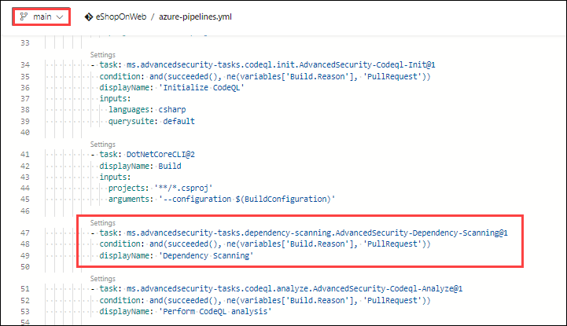

1. Click on **Run** to run the pipeline configuration file, which will set the dependency scanning.

    

1. The build will run automatically, initiating the dependency scanning task and publishing the results to Advanced Security. Please note that this process may take up to 15 minutes to finish. 

   > **Note:** Once the build has succeeded, you can ignore the permission needed prompt under the **Test Deployment** and proceed with the next task.

### Task 2: Viewing alerts of repository

1. Go to the **Repos** tab and click on the **Advanced Security** menu item at the bottom.

1. Click on **Dependencies** to see a list of all the dependencies alerts that have been found. This includes the alert, vulnerable package, and first detected date. We can easily clean up the dependencies.

#### Dependency Scanning Alert Details

1. Click on the item ***Improper Input Validation in IpMatcher...*** to see the details about this alert.

1. This includes the Recommendation, Locations found,  Description, Severity, and the Date it was first detected. We can easily clean up the dependencies. 

   

1. You can also view the code that triggered the alert and what build detected it.

1. Click on **Detections** to see the different builds that detected this alert.

   

   > **Note:** When a vulnerable component is no longer detected in the latest build for pipelines with the dependency scanning task, the state of the associated alert is automatically changed to closed. To see these resolved alerts, you can use the **State filter** in the main toolbar and select **Closed**.


#### Understanding Dependency Alerts

In your repository, there are two types of dependencies: direct and transitive (also known as indirect).

- **Direct dependencies** are components of your project.

- **Transitive dependencies** are components used by direct dependencies.


### Task 3: Fixing dependency scanning alerts

You can follow the recommended steps to manually update dependencies.

When a Dependency Alert is created in Azure DevOps Advanced Security, it will contain details about the vulnerability and steps you can take to resolve it.

1. To view the alert, go to the Azure DevOps Advanced Security dashboard, scroll down, and click on the alert  **Improper Input Validation in IpMatcher....**

1. Review Recommendation, Location, Description, and Severity to understand the vulnerability and how to resolve it.

1. Click on the **Locations** to see the code that triggered the alert.
 
1. Copy the repo URL from Azure DevOps by navigating to the **Repos** section from the left navigation pane, clicking on **Clone** to get the repo URL, and taking note of it in the notepad.

    

    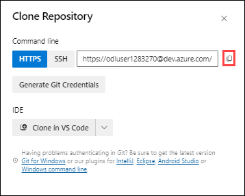

1. Select the Start menu and search for **Visual Studio 2022**. Select **Visual Studio 2022** to run it.

1. **Sign in** to Visual Studio 2022 with the credentials email address: **<inject key="AzureAdUserEmail"></inject>** and Password:**<inject key="AzureAdUserPassword"></inject>** and later select **Start Visual studio**.

    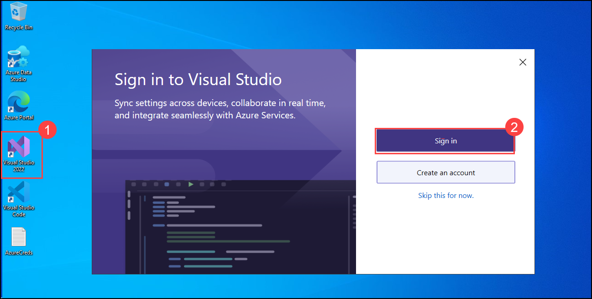

    

1. Select **Clone a repository** under **Get Started** and enter the **clone URL** under **Repository location**, which was copied earlier. Ensure the Path is **C:\Users\azureuser\Source\Repos\eShopOnWeb** and then click on **Clone**.	

    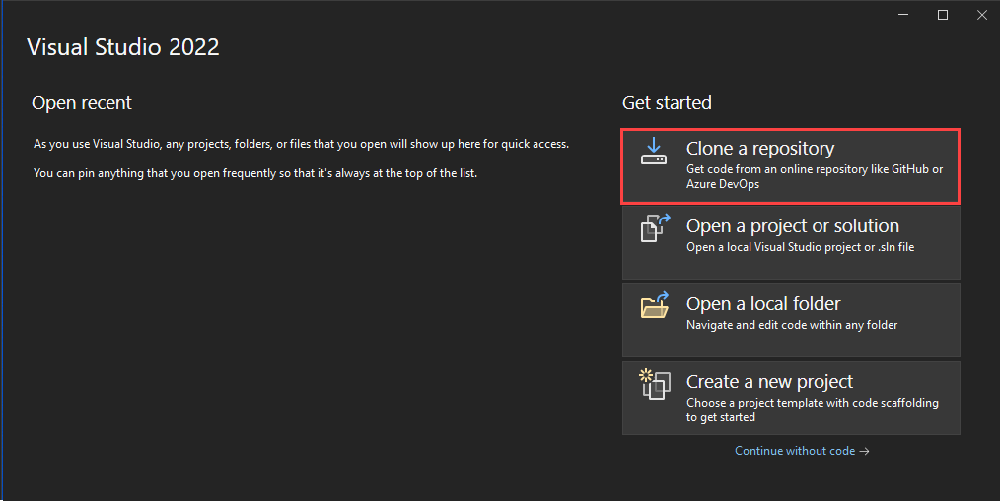

    

1. While cloning the repo, Git-credentials Manager pops up. Enter the **Username:** **<inject key="AzureAdUserEmail"></inject>** and **Password:** **<inject key="AzureAdUserPassword"></inject>**

1. Create a new branch to make the necessary changes. Select the **main (1)** branch from the lower right corner and select **New branch (2)**.

    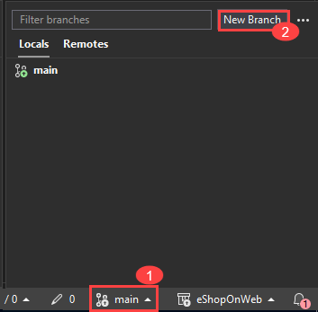

    > **Note:** This step is necessary since the main branch is protected by a pull request pipeline.

1. On **Create a new branch** window, enter **Codefix (1)** and click on **Create (2)**.

    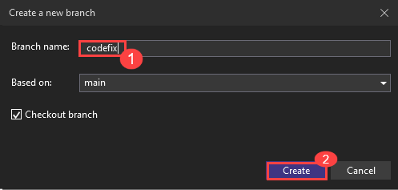

1. Double-click the **eShopOnWeb.sln** solution file.  

    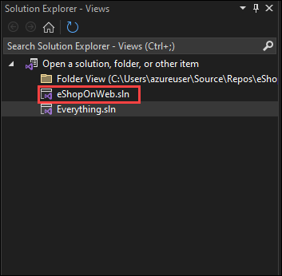

1. Once the source code is opened in Solution Explorer, navigate to the **Dependencies** section under **Web.(SRC>Web)**.

    

1. Right-click on **Dependencies** and choose **Manage Nuget Packages...**.

    

1. Click on **IpMatcher**, and you will be able to see a warning regarding the vulnerability in that specific version.

    

1. Change the version as per the suggestion, which is **1.0.4.2** and select **Update**.

    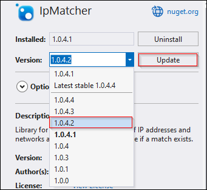

1. On **preview changes** pop-up, click on  **Apply**.

   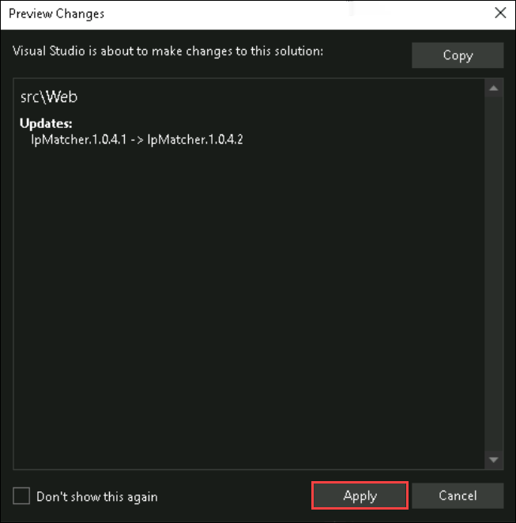

1. Switch to the **GitChanges (1)** tab and select **Configure (2)** to add the username and email address that are required before committing changes.

    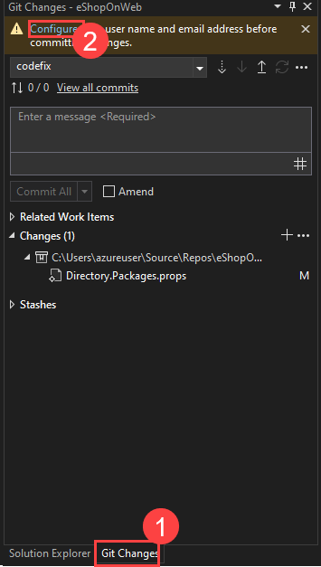

1. Click on **Save**.

    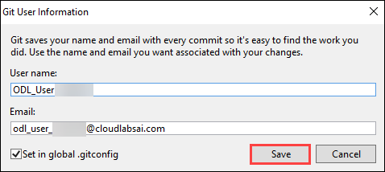

1. Add the required **description** and select the **Commit All and Push** option to push the changes to Origin.

    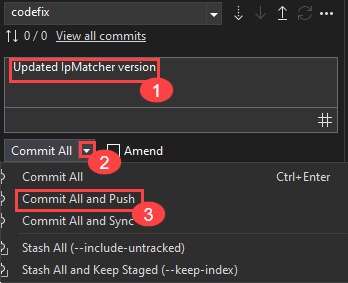

    >**Note:** On the **Commit** pop-up select **Save and commit**.

1. Navigate to **Azure DevOps**, click on **Repos**, select **Pull requests** and select **Create a pull request** to push the commits from **codefix** to the **main**.

   

1. On the **New pull request** page, add the work item from the list **(1)** and click on **Create (2)**.

    

    > **Note:** The build will run automatically, initiating the dependency scanning task and publishing the results to Advanced Security. The alert will then automatically close.

1. Once the **eShoponWeb** pipeline has been completed, click on **Approve (1)** and then click on **Complete (2)**, 

   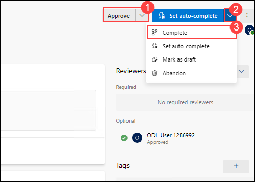

1. To merge changes into the main branch, change the Merge Type to **Squash commit (1)**. Then, uncheck the boxes for **Complete associated work items after merging (2)** and **Delete Codefix after merging (2)**. Finally, click **Complete merge (3)**.

   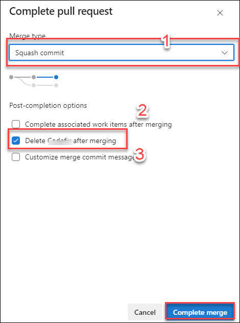

    > **Congratulations** on completing the task! Now, it's time to validate it. Here are the steps:
    > - Click the Lab Validation tab located at the upper right corner of the lab guide section and navigate to the Lab Validation Page.
    > - Hit the Validate button for the corresponding task. If you receive a success message, you can proceed to the next task. 
    > - If not, carefully read the error message and retry the step, following the instructions in the lab guide.
    > - If you need any assistance, please contact us at labs-support@spektrasystems.com. We are available 24/7 to help you out.

<validation step="f36e777d-dc2f-42c3-9afe-e54c2d9eff60" />

### Task 4: Dismissing dependency scanning alerts

1. Navigate to the **pipelines section** and wait for it to complete. It might take up to 20 minutes.

1. Once the pipeline has been completed, **eShopOnWeb**, go to the Azure DevOps Advanced Security dashboard and click on **Dependencies**.

1. You will see that the alert **Improper Input Validation in IpMatcher....** no longer exists. It is now closed.

   > **Note:** This is a great way to ensure you are using the latest and greatest versions of your dependencies and also to ensure you are not using any vulnerable versions.

## Review
In this lab, you have completed the following:
- Setup Dependency Scanning.
- Viewed alerts of the repository.
- Fixed dependency scanning alerts.
- Dismissed dependency scanning alerts.

Click on **Next** to continue with the next lab.
