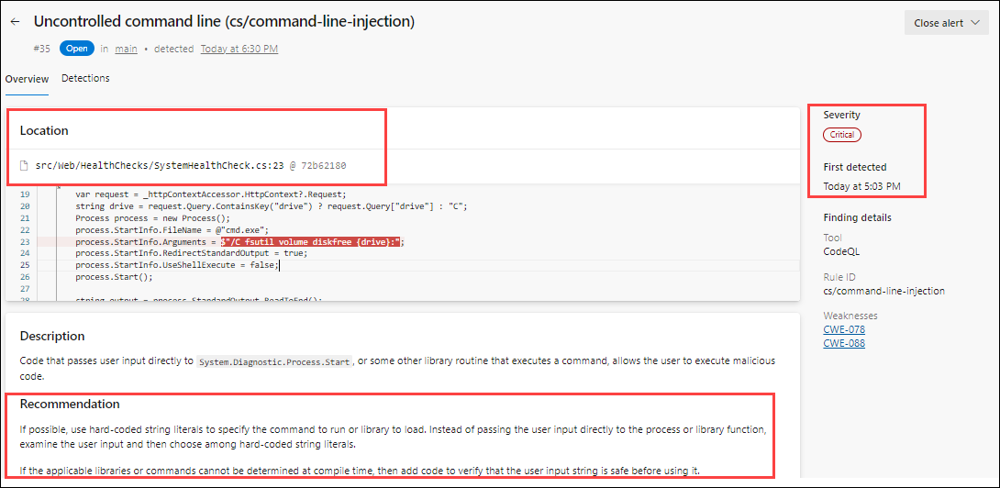
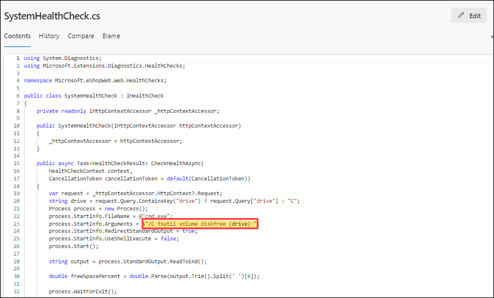
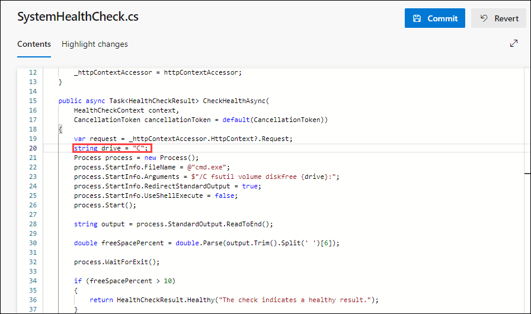
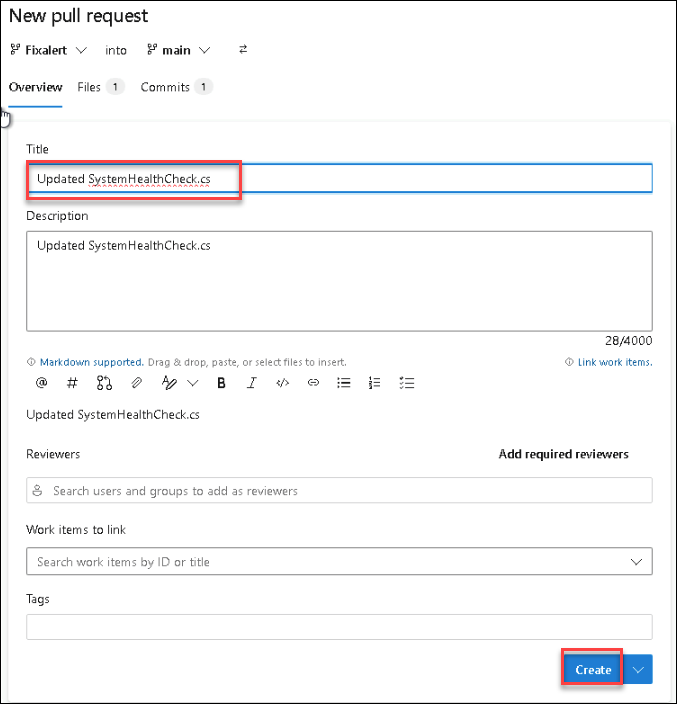

# Lab 04: Code scanning

## Lab Scenario

In this lab, You will set up code scanning in Azure DevOps using GitHub Advanced Security to analyze code for security vulnerabilities and errors. You will review code scanning alerts, fix identified issues in the code, and dismiss resolved alerts, thereby enhancing the security of their codebase.

## Lab Objectives

In this lab, you will perform the following:

- Task 1: Setup Code Scanning
- Task 2: Review Code Scanning Alert (Gain Insights)
- Task 3: Fixing the Code to resolve the alert
- Task 4: Dismissing the code scanning alerts 

## Estimated Timing: 45 minutes

## Architecture Diagram

  

### Task 1: Setup Code Scanning

Code Scanning in GitHub Advanced Security for Azure DevOps enables automated analysis of your code to detect security vulnerabilities and coding issues. By integrating CodeQL, it provides in-depth insights into potential flaws in your codebase. Alerts are generated for any detected issues, helping you address them before deployment. This ensures continuous security and quality improvement in your development workflow.

1. Select the pipeline **eShopOnweb**.

   

1. Locate the tasks related to **Advanced Security Code Scanning** that are already included in the YAML pipeline file.

   
 
1. Do not run the pipeline. The code scanning setup has already been initiated, along with dependency scanning performed in the previous lab.

   You can learn more about Code scanning with DevOps advance secutiy [here.](https://learn.microsoft.com/en-us/azure/devops/repos/security/github-advanced-security-code-scanning?view=azure-devops)
   If you turn off Advanced Security for your repository, you lose access to the results in the Advanced Security tab and build task. The build task does not fail, but any results from builds run with the task while Advanced Security is disabled are hidden and not retained. As we have already enabled the Advanced security for the Repositry, and have added all the required task in pipeline to generate the alerts, you should be able to see the results in advanced security dashboard.

### Task 2: Review Code Scanning Alert (Gain Insights)

1. Go to the **Repos** tab and click on the **Advanced Security** menu at the bottom.

1. Click on **Code scanning** to see a list of all the code scanning alerts that have been found. This includes the alert, vulnerable code details, and first detected date.

    

#### Code scanning Alert Details

1. Click on the item ***Uncontrolled command line...*** to see the details about this alert.

1. This includes the Recommendation, Locations found, Description, Severity, and the Date it was first detected. We can easily fix this threat. 

   

1. You can also view the code that triggered the alert and what build detected it.
   
1. Click on **Detections** to see the different builds that detected this alert.

   

    **ProTip!** When a vulnerable code is no longer detected in the latest build for pipelines with the dependency scanning task, the state of the associated alert is automatically changed to Closed. To see these resolved alerts, you can use the **State filter** in the main toolbar and select **Closed**.

### Task 3: Fixing the Code to resolve the alert

1. This is simple to fix using parameters in the command line described in the remediation steps.

1. Click on **Locations found** to see the code that triggered the alert.

   

1. Click on the **Edit** button to edit the file. Line number 23 is highlighted here. 

1. The value of __{drive}__ is getting highlighted from line number 23.

    

1. Instead of getting the value of 
__{drive}__ using a query, we can directly define it as __C__ for the string drive variable in the line 20. Replace the line number 20 with the below string.
    ```C#
    string drive = "C";
    ```

    

1. Click on **Commit** to save changes. Enter **Fixalert** for the branch name and Check **Create a pull request**, and then click on **Commit** again.

    

    > **Note:** This step is necessary since the main branch is protected by a pull request pipeline.

1. You will be navigated to the new pull required page to push the commits from **Fixalert** to the **main**, just click on **Create**.

    

1. Once the **eShoponWeb** pipeline has been completed, click on **Approve** and then click on **Complete**.

    

1. Change **Merge Type** to **Squash commit** and check the box **Delete Fixalert after merging** to merge changes into the main branch.

    

    > **Note**: The build will run automatically, initiating the code scanning task and publishing the results to Advanced Security.


### Task 4: Dismissing the code scanning alerts 

Once after the completion of the build, if you navigate to the __Code scanning__ section of __Advanced Security__. You will find the alert is closed automatically.

## Review
In this lab, you have completed the following:

- Setup Code Scanning.
- Reviewed Code Scanning Alert (Gain Insights).
- Fixed the Code to resolve the alert.
- Dismissed the code scanning alerts. 

Click on **Next** to proceed with the next lab.
