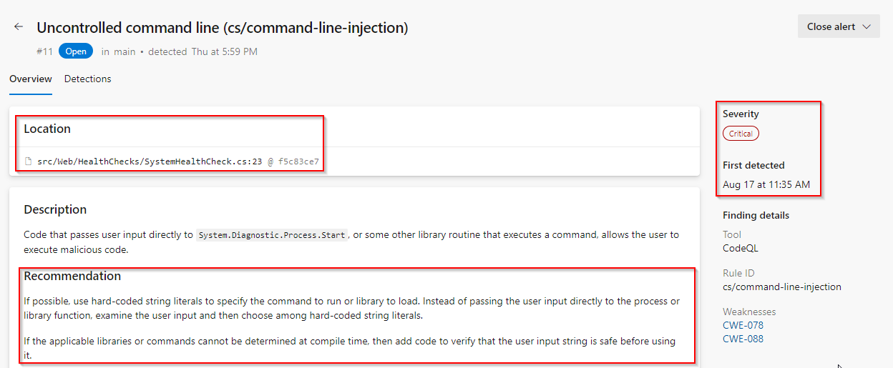
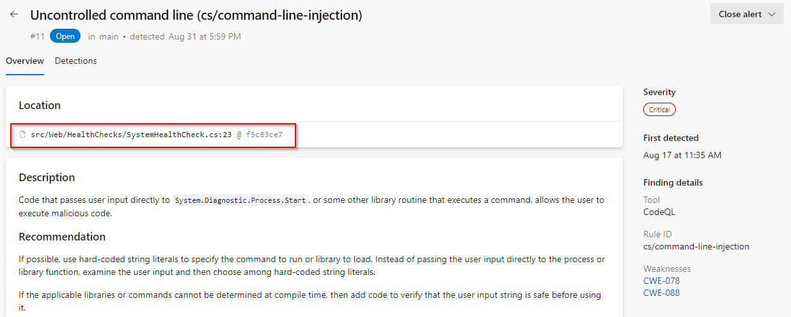
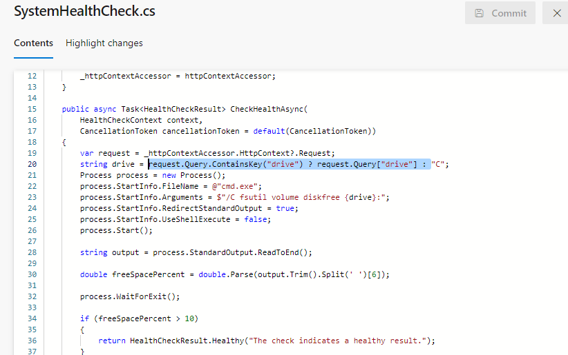
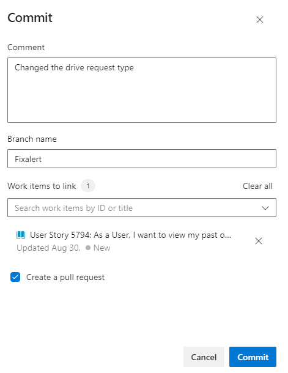
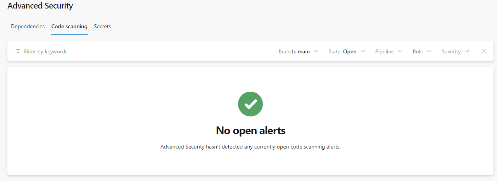

## Lab 04: Code scanning

### Task 7: Setup Code Scanning

Code scanning in GitHub Advanced Security for Azure DevOps lets you analyze the code in an Azure DevOps repository to find security vulnerabilities and coding errors. Any problems identified by the analysis are raised as an alert. Code scanning uses CodeQL to identify vulnerabilities.

1.	Select and Edit the pipeline you want to add scanning to, **eShopOnweb**

1.	Locate the section where the build steps are defined, hint: look for *- task: DotNetCoreCLI@2*.

1.	Add the task *Initialize CodeQL*(ms.advancedsecurity-tasks.codeql.init.AdvancedSecurity-Codeql-Init@1) directly to your YAML pipeline file. This task will be added before the Dotnet build.

1.	 *- task: ms.advancedsecurity-tasks.codeql.init.AdvancedSecurity-Codeql-Init@1*

     *- task: ms.advancedsecurity-tasks.codeql.analyze.AdvancedSecurity-Codeql-Analyze@1*. Add this task after dependency scanning.
 
1.	Click **Save** to save the pipeline configuration file.

### Task 8: Review Code Scanning Alert (Gain Insights)

1.	Go to the **Repos** tab and click on the Advanced Security menu item at the bottom.

1.	Click on **Code scanning** to see a list of all the code scanning alerts that have been found. This includes the Alert, Vulnerable code details, and First detected date.

#### Code scanning Alert Details

1.	Click on the item ***Uncontrolled command line...*** to see the details about this alert.

2.	This includes the Recommendation, Locations found,  Description, Severity, and the Date it was first detected. We can easily fix this threat. 

    

3.	You can also view the code that triggered the alert and what build detected it.
    

4.	Click on Detections to see the different builds that detected this alert.


    > ProTip!
    > When a vulnerable component is no longer detected in the latest build for pipelines with the dependency scanning task, the state of the associated alert is automatically changed to Closed. To see these resolved alerts, you can use the State filter in the main toolbar and select Closed.


#### Fixing the Code to resolve the alert
1.	This is simple to fix using the method using parameters with dynamic SQL described in the Remediation steps.

1.	Click on Locations found to see the code that triggered the alert.

    

1.	Click on the Edit button to edit the file. Line number 23 is highlighted here. 

1. The value of __{drive}__ is getting red from the line number 20.

    

1. Instead of getting the value of 
__{drive}__ using a query, we can directly define it as __C__.
    ```C#
    string drive = "C";
    ```

    

1. Click Commit to save changes. Enter *Fixalert* for branch name and check Create a pull request, then click Commit again.

    

    >Note: This step is necessary since the main branch is protected by a pull request pipeline.

1.	Click Create on the New pull request page to merge the changes into the main branch.

1. Make sure all the policies are followed and complete the pull request.

1.  This will run the **eShopOnWeb** pipeline.

    >Note: The build will run automatically, initiating the code scanning task and publishing the results to Advanced Security.

1. Once after the completion of the build, if you navigate to the __Code scanning__ section of __Advanced Security__. You find the alert is closed automatically

    
